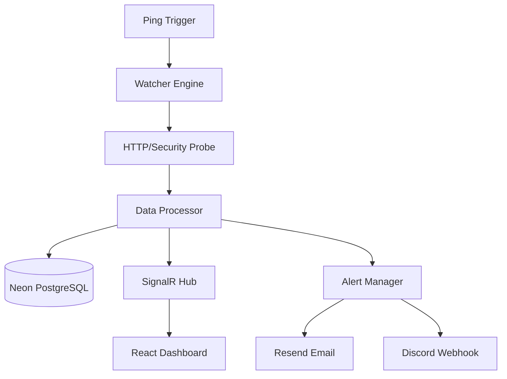
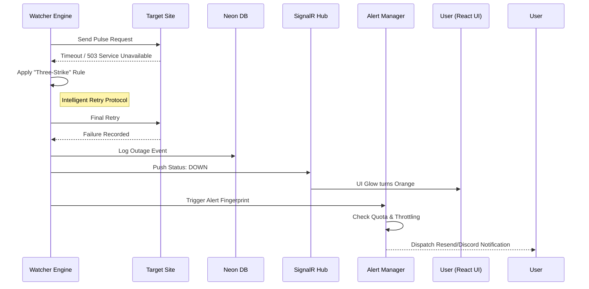

# KindleKeep: Professional Uptime Monitoring & Security Auditing System

> **Always On. Always Secure.**

KindleKeep is an enterprise-grade observability engine designed to bridge the gap between basic uptime pings and expensive monitoring suites. It focuses on deep security audits and real-time performance metrics, ensuring that a $0 budget result in a $0 security posture.

---

## Table of Contents

- [1. Project Introduction](#1-project-introduction)
- [2. Market & Strategic Analysis](#2-market--strategic-analysis)
- [3. Brand Identity & Design System](#3-brand-identity--design-system)
- [4. System Architecture & Diagrams](#4-system-architecture--diagrams)
- [5. Development Standards & Coding Conventions](#5-development-standards--coding-conventions)
- [6. Functional Requirements](#6-functional-requirements)
- [7. Data Design (Schema)](#7-data-design-schema)
- [8. Third-Party Integration & Ecosystem](#8-third-party-integration--ecosystem)
- [9. Non-Functional Requirements](#9-non-functional-requirements)
- [10. Deployment & DevOps](#10-deployment--devops)
- [11. UI/UX Architecture & Page Specifications](#11-uiux-architecture--page-specifications)
- [12. Advanced Resiliency & The Sentinel API](#12-advanced-resiliency--the-sentinel-api)
- [13. Advanced Notification Ecosystem](#13-advanced-notification-ecosystem)
- [14. Governance, Privacy & Data Portability](#14-governance-privacy--data-portability)
- [15. Service Level Expectations](#15-service-level-expectations)
- [16. Technical Logic Refinements](#16-technical-logic-refinements)
- [17. Local Development & Environment Strategy](#17-local-development--environment-strategy)
- [18. Repository Strategy & Structure](#18-repository-strategy--structure)
- [19. AI Collaboration Protocol](#19-ai-collaboration-protocol)

---

## 1. Project Introduction

### Project Vision: The Zero-Cost Reliability Problem

In 2026, the "Free Tier" ecosystem (Render, Vercel, Neon) has become the backbone of independent software development. While these platforms democratize hosting, they introduce a "Reliability Gap." Research shows that while 98.8% of web traffic is now encrypted, nearly 70% of applications are either missing a Content Security Policy (CSP) or using one so weak it provides zero protection against injection attacks. Furthermore, 34% of modern apps still fail to implement HSTS, leaving them vulnerable to protocol downgrades. For a developer on a $0 budget, these "Security Misconfigurations" are often the primary cause of project failure or professional embarrassment.

### Scope of Work

KindleKeep operates as a non-intrusive, external observability layer. It focuses on the "Public Health" of a web application through four core pillars:

- **Availability Monitoring**: 24/7 verification of HTTP/HTTPS accessibility to ensure projects remain online despite platform-specific "sleep cycles."
- **Performance Benchmarking**: Precise measurement of Time to First Byte (TTFB) and total network latency. This is critical for 2026 serverless environments where "Cold Starts" are now a direct financial and engagement penalty (the INIT Billing Paradox).
- **Security Auditing**: Automated inspection of SSL/TLS certificate lifecycles and proactive auditing of the four critical defense headers (CSP, HSTS, X-Frame-Options, and X-Content-Type-Options).
- **Real-Time Incident Response**: Utilizing SignalR to push status changes and security grade fluctuations to a central dashboard instantly.

> [!NOTE]
> **Out of Scope**: This system will not require internal access (no "agents" or "SDKs" needed in the target code). It will not monitor server-side RAM/CPU or private database internal logs.

### Target Audience

The system is built specifically for:

- **Student Developers**: Building professional portfolios where a single "Connection is not private" warning can lead to immediate recruiter rejection.
- **Indie Hackers**: Launching MVPs on free-tier infrastructure where uptime is the only thing standing between a launch and a failure.
- **Full-Stack Engineers**: Managing "side-hustles" that require 24/7 oversight without a monthly subscription fee.

### Key Objectives

- **Democratized Security**: Translating complex OWASP-level security data into a simple, actionable Security Grade (A-F) accessible to any developer.
- **Sub-Second Reporting**: Achieving near-zero latency in status reporting using WebSockets to ensure the developer is the first to know of a failure.
- **Resource Efficiency**: Maintaining a persistent monitoring loop while strictly adhering to the resource limits and "idle policies" of free-tier providers.
- **Zero-Cost Sustainability**: Proving that a robust, professional monitoring stack can be built and operated on a permanent $0 budget.

---

## 2. Market & Strategic Analysis

### Competitor Analysis

The observability market in 2026 is divided into three archetypes: the high-volume legacy provider (UptimeRobot), the design-centric incident platform (Better Stack), and the developer-first synthetic suite (Checkly). KindleKeep identifies a critical gap in these offerings: Security is currently treated as a premium commodity.

| Feature Metric          | KindleKeep            | UptimeRobot     | Better Stack | Checkly         |
| :---------------------- | :-------------------- | :-------------- | :----------- | :-------------- |
| **Free Tier Frequency** | Custom (Keep-alive)   | 5-Minute        | 3-Minute     | 2-Minute        |
| **Security Auditing**   | Native CSP, HSTS, XFO | Not Included    | Not Included | Manual/Scripted |
| **SSL Monitoring**      | Free Expiry & Health  | Paid Only       | Paid Only    | Paid Only       |
| **Real-time UI**        | SignalR Streaming     | Static/Refresh  | Static/Basic | Metric-based    |
| **Commercial Use**      | Permitted ($0)        | Restricted      | Permitted    | Permitted       |
| **Alerting Channel**    | Resend (Branded)      | Multi (Limited) | Slack/Email  | Email/Slack     |

### Market Gap Analysis

Legacy tools like UptimeRobot create a "Security Blind Spot." A project can be technically "up" via a ping but functionally "broken" due to an expired SSL certificate or vulnerable to XSS due to missing headers. Most incumbents gate these critical security features behind expensive "Pro" or "Enterprise" tiers, making professional-grade security inaccessible to bootstrapped developers.

### Competitive Edge

KindleKeep distinguishes itself by shifting the monitoring paradigm from simple connectivity to **Continuous Exposure Management (CEM)**.

1. **Automated Runtime Auditing**: Instead of one-off manual audits, KindleKeep integrates security checks into the persistent heartbeat of the monitoring loop. It continuously verifies CSP, HSTS, and X-Frame-Options.
2. **The A-F Grading System**: The system translates technical headers into a letter grade. For a developer, this provides "Social Proof" of their technical competence. An "A" grade from KindleKeep serves as a shorthand for "Security-by-Design," a high-value asset for professional portfolios and job interviews.
3. **Performance vs. Billing Awareness**: By monitoring TTFB, KindleKeep helps developers identify "Cold Start" initialization delays. In 2026, where serverless providers bill for the "INIT" phase, this data is essential for controlling cloud costs on a tight budget.

### SWOT Analysis

#### Strengths

- **High-Performance Engine**: Built on .NET 10, allowing for rapid, concurrent processing of audits with minimal memory overhead.
- **Serverless Scalability**: Utilization of Neon’s serverless PostgreSQL allows the database to "scale to zero," ensuring the $0 budget is sustainable.
- **Real-Time Interactivity**: SignalR provides a persistent, bi-directional connection, offering a UI that updates faster and feels more "live" than legacy competitors.

#### Weaknesses

- **Free-Tier Volatility**: Dependence on Render’s 15-minute sleep policy requires a "Keep-Alive" strategy to maintain 24/7 monitoring.
- **Storage Constraints**: Neon’s 0.5 GB storage limit on the free tier necessitates aggressive data pruning and aggregation of historical logs.
- **Ephemeral Filesystem**: No local data persistence between service restarts on Render, requiring all state to be managed via Postgres or Redis.

#### Opportunities

- **Infrastructure-as-Code (IaC) Integration**: Future capability to export security header configurations directly for Nginx, Apache, or Vercel.
- **Community Scaling**: Offering real-time dashboard sharing for collaborators without the "per-seat" pricing models used by enterprise tools.
- **AI-Driven Remediation**: Potential to integrate AI models that suggest specific code fixes to improve a project’s Security Grade.

#### Threats

- **Service Provider Fragility**: Sudden changes in free-tier policies from providers (Render, Neon, or Vercel) could force rapid architectural migrations.
- **Alert Fatigue**: Risk of exhausting Resend's daily email limits (100/day) if a user monitors too many volatile sites without proper alert throttling.
- **T&S Enforcement**: Increased scrutiny from hosting providers regarding "Keep-Alive" pings intended to circumvent idle-service sleep cycles.

---

## 3. Brand Identity & Design System

The visual identity of KindleKeep is engineered to feel like a high-end technical utility. It moves away from the common "SaaS Blue" aesthetic, favoring a professional, industrial-grade look that prioritizes data density and surgical precision.

### Design Philosophy: "The Precision Scavenger"

The interface represents the "Keep-Alive" soul of the project: clean, efficient, and breathing.

- **Industrial Minimalism**: Using sharp edges and high-contrast neutrals to represent infrastructure stability.
- **The Spark Principle**: A monochrome base (Zinc) is brought to life by a single, high-energy accent (Blue) to represent active pulses and pings.
- **High-Density Clarity**: Layouts are designed to show maximum data without clutter, utilizing the precision of the Radix design system.

### Color Palette: "Zinc & Spark"

A refined, neutral palette designed for perfect legibility in both Light and Dark modes.

| Element              | Dark Mode | Light Mode | Hex (Sample)      |
| :------------------- | :-------- | :--------- | :---------------- |
| **Background**       | Zinc-950  | Zinc-50    | #09090B / #FAFAFA |
| **Surface (Cards)**  | Zinc-900  | White      | #18181B / #FFFFFF |
| **Primary Accent**   | Blue-500  | Blue-600   | #3B82F6 / #2563EB |
| **Secondary Accent** | Iris-400  | Iris-600   | #A78BFA / #7C3AED |
| **Borders**          | Zinc-800  | Zinc-200   | #27272A / #E4E4E7 |

### Typography: The Engineered Stack

Unique, bespoke font choices define the identity of KindleKeep.

- **The Wordmark (Logo): Righteous**
  - All lowercase (kindlekeep). The unique loops in the 'k' and 'e' create a rhythmic, memorable wordmark.
- **Primary Headings: Unbounded**
  - Variable Weight (Bold/Black). A wide, geometric font that feels "carved" and high-tech.
- **UI & Body: Onest**
  - Regular/Medium. An ultra-clean, functional font that ensures status codes and metrics remain the hero.

### Component Architecture: Radix UI Themes

- **Technical Choice**: Cohesive design system used by leaders like Linear and Railway.
- **Density**: Components tuned for high-density monitoring views.
- **Type-Safety**: Fully written in TypeScript.
- **Visual Style**: Small/None radius for sharp corners, compact scaling for high-density data.
- **Icons**: Lucide React with 1px stroke for a wireframe look.

### Motion & Feedback

- **The Kindle Glow**: Active monitors emit a subtle, 2px outer glow in Blue-500, creating a "breathing" effect.
- **Mechanical Transitions**: Modals use Framer Motion with high-stiffness "spring" physics to mimic professional hardware consoles.

---

## 4. System Architecture & Diagrams

### Architecture Overview

The system is built on a modern stack: **C# Backend**, **React Frontend**, and **PostgreSQL Database**.

### System Flowchart: The Automated Loop

### Sequence Diagram: Critical Alert Lifecycle

---

## 5. Development Standards & Coding Conventions

KindleKeep follows a strict **Clean Architecture** pattern to decouple logic from infrastructure.

### Project Structural Architecture

The system is divided into two primary repositories:

#### Backend (.NET 10)

- `/API`: Controllers and SignalR Hubs.
- `/Core`: Background Services (The Watcher) and Domain logic.
- `/Infrastructure`: Data Context, Repositories, and Third-party clients (Resend/Sentry).
- `/Shared`: DTOs and common constants.

#### Frontend (React/Vite)

- `/components`: Reusable Atomic elements.
- `/hooks`: SignalR and API logic encapsulation.
- `/store`: Global state management (Zustand).
- `/services`: Axios/Fetch calls to the API.

### Industry-Standard Naming Conventions

- **Backend (C#)**: PascalCase for Classes/Methods, 'I' prefix for Interfaces, camelCase for local variables, \_camelCase for private fields.
- **Frontend (React/TS)**: PascalCase for Components, kebab-case for non-component files, SEO-optimized naming for assets.

### The AI-Collaborative Syntax Guide

- **Minimalist Documentation**: Comments only for "The Why." Avoid commenting on obvious code.
- **Technical Integrity**: No "FIXME" or "TODO."
- **Modern Syntax**: Prioritize .NET 10 features and Primary Constructors.
- **No Emojis**: Strictly technical and professional tone.

### Quality Assurance & Testing Suite

- **Unit Testing (xUnit)**: Focus on Sentinel Grading Logic.
- **Integration Testing**: Mocking HttpClient to simulate down sites or expired SSL.
- **SignalR Load Test**: Ensuring stability within Render's 512MB RAM limit (using Native AOT).

### High-Performance Library Stack

| Category         | Backend (.NET 10)              | Frontend (React + TS)         |
| :--------------- | :----------------------------- | :---------------------------- |
| **Logic**        | Polly (Retry/Circuit Breaking) | TanStack Query (Caching/Sync) |
| **Validation**   | FluentValidation               | Zod                           |
| **State**        | SignalR                        | Zustand                       |
| **Logging/Docs** | Serilog, Scalar/Swagger        | Lucide React                  |

### Package Management & Tooling

- **Primary Manager**: pnpm (v10.x+).
- **Rationale**: Minimal disk footprint and dependency strictness. Ensures parity between Vercel and local dev.

---

## 6. Functional Requirements

### Identity & Access Management

- **Multi-Provider OAuth 2.0**: Secure auth via GitHub, Google, or GitLab.
- **Stateless Session Control**: JWT management across service restarts.

### The Observability Engine (The Watcher)

- **Agentless Cold Start Detection**: Isolates server-side INIT lag by subtracting network transit from TTFB.
- **Edge-Network Awareness**: Inspects headers to correlate latency with cache misses (e.g., x-vercel-cache).
- **Intelligent Retry Protocol**: Executes a "three-strike" rule before logging an incident.

### The Security Sentinel (The Auditor)

- **Active Protocol Probing**: Deliberately attempts deprecated TLS 1.0/1.1 connections to verify rejection.
- **DNS & Trust Integrity**: DNSSEC validation and CAA record auditing.
- **Automated Security Grading**: Weighted algorithm auditing CSP, HSTS, XFO, and ALPN.

### Alerting & Intelligent Clustering

- **Alert Fingerprinting**: Unique hash for incident clustering.
- **Incident Grouping**: Root failure clustering to conserve Resend email quota.
- **Exponential Alert Backoff**: Notification jitter to avoid noise during recovery.

### Developer Workflow & Remediation

- **GitHub Webhook**: CI/CD trigger for immediate "Sentinel Audit" post-deploy.
- **Remediation Exports (IaC)**: Generates configuration snippets for Fixes (vercel.json, nginx.conf, middleware.ts).
- **Digest Mode**: Consolidates multiple failures into a single incident report email.

### High-Density Dashboard Experience

- **SignalR Pulse Stream**: Live, bi-directional heartbeat pushes.
- **Terminal-Style Debug Logs**: Integration of xterm.js for raw probe logic debugging.
- **Live Header Inspector**: Real-time monitoring of response header fluctuations.

---

## 7. Data Design (Schema)

### Detailed Relational Models

#### A. Users (Identity & Profile)

- **Id**: Guid (PK)
- **ExternalId**: String (OAuth ID)
- **AuthProvider**: Enum (GitHub, Google, GitLab)
- **Email**: String
- **DisplayName**: String
- **AvatarUrl**: String
- **MonitorLimit**: Int (Default 5)

#### B. MonitorTargets (Configuration)

- **Id**: Guid (PK)
- **UserId**: Guid (FK)
- **Url**: String,
- **FriendlyName**: String
- **LastAuditHash**: String (Nullable, Indexed)
- **IntervalMinutes**: Int (Default 10)
- **IsActive**: Bool (Toggle)
- **RequestTimeout**: Int (Default 30s)
- **RequestHeaders**: JSONB (Auth headers)
- **CurrentUptimeStatus**: Enum (Healthy, Down, Degraded)
- **CurrentSecurityGrade**: Char (A-F)
- **UpdatedAt**: DateTime (UTC)

#### C. UptimeLogs (Pulse Metrics)

- **Id**: BigInt (PK), **MonitorId**: Guid (FK)
- **StatusCode**: Int, **LatencyMs**: Int
- **IsColdStart**: Bool
- **ErrorMessage**: Text
- **Timestamp**: DateTime (Indexed)

#### D. SecurityAudits (Sentinel Log)

- **Id**: Guid (PK), **MonitorId**: Guid (FK)
- **SslExpiryAt**: DateTime, **SslIssuer**: String
- **HasCsp**, **HasHsts**, **HasXfo**, **HasNosniff**: Bool
- **TlsVersion**: String
- **RawHeaders**: JSONB (Full snapshot)

#### E. Incidents (Alerting State)

- **Id**: Guid (PK), **MonitorId**: Guid (FK)
- **Fingerprint**: String, **StartTime**: DateTime
- **ResolvedTime**: DateTime (Null if active)
- **OccurrenceCount**: Int
- **LastNotificationSentAt**: DateTime

### Relationships & Integrity

- **User ⇔ MonitorTarget**: One-to-Many (Cascade delete).
- **MonitorTarget ⇔ UptimeLogs**: One-to-Many (7-day pruning).
- **MonitorTarget ⇔ SecurityAudit**: One-to-Many.
- **MonitorTarget ⇔ Incidents**: One-to-Many.

---

## 8. Third-Party Integration & Ecosystem

KindleKeep uses a "Cloud-Native Scavenger" architecture to distribute workload across specialized providers.

| Service         | Category  | Technical Role        | Free-Tier Strategy                             |
| :-------------- | :-------- | :-------------------- | :--------------------------------------------- |
| **Render**      | Backend   | API & Watcher Engine  | Pulse every 14 mins to prevent spin-down.      |
| **Vercel**      | Frontend  | React Dashboard       | Edge caching & Cold Start headers.             |
| **Neon**        | Database  | Serverless PostgreSQL | Autoscaling to zero for cost efficiency.       |
| **Resend**      | Email     | Transactional Alerts  | Alert Fingerprinting to protect 100/day limit. |
| **Cloudflare**  | DNS       | Domain & SSL          | SSL termination & Full encryption mode.        |
| **Upstash**     | Caching   | Redis backplane       | Stores snapshots to reduce SQL load.           |
| **Discord**     | Webhook   | High-Volume Alerts    | Used for frequent up/down notifications.       |
| **UptimeRobot** | Heartbeat | Wake-Up Call          | Pings /api/stay-awake every 12 mins.           |

### Operational "Smart" Integrations

- **Sentry**: Captures "Silent Failures" (API timeouts, DB connection drops).
- **GitHub Actions**: Automated workflows with "Post-Deploy Sweeps."
- **Tiered Alerting**: Discord for frequency, Resend for critical state changes.
- **Redis Snapshotting**: Frontend pulls snapshots from Upstash for sub-second load times.

---

## 9. Non-Functional Requirements

### Performance & Resource Efficiency

- **Memory Optimization (Native AOT)**: Targeted idle footprint <65MB, peak load <120MB.
- **Cold Start Minimization**: Backend startup time <110ms through AOT.
- **High-Density SignalR**: Support for 50 concurrent connections on a single free instance.
- **Lighthouse Excellence**: Performance score of 90+ using Vite tree-shaking.

### Reliability & Database Resilience

- **Neon Cold-Start Handling**: 15-second Npgsql timeout to allow serverless wake-up.
- **Automatic Recovery**: Exponential Backoff with Jitter for external pings.
- **Stateless Persistence**: No local file storage; all state resides in PostgreSQL.

### Security & Browser Isolation (2026 Standards)

- **Cross-Origin Isolation**: Implement BCG separation via COOP and COEP.
- **Granular Feature Governance**: Strict Permissions-Policy to disable unnecessary browser APIs.
- **Layout Stability**: Document-Policy enforcement for unsized media to prevent CLS.

### Economic Sustainability

- **Compute-Unit (CU) Guard**: Global Throughput Limit of 20 RPS to stay within Neon limits.
- **Aggressive Data Pruning**: Purge success logs >7 days; retain incidents for 90 days.
- **Soft-Quota System**: "Auto-Pause" monitors that redirect excessively to protect CPU.

---

## 10. Deployment & DevOps

### CI/CD Pipeline

- **Backend (Render)**: Dockerfile deployment with .NET 10 Native AOT build.
- **Frontend (Vercel)**: Linting, testing, and edge network deployment.

### Secret Management

- **Development**: .NET Secret Manager and .env.local.
- **Production**: Environment Variables stored in Render/Vercel dashboards.
- **CORS**: Restricted to specific production domains.

### 30-Day Execution Roadmap

- **Week 1**: Core Engine & Identity (OAuth, Neon DB, Basic Watcher).
- **Week 2**: Security Sentinel (SSL/Header Audits, A-F Grading).
- **Week 3**: Command Center (React Dashboard, SignalR Pulse).
- **Week 4**: Alerting & Launch (Resend, Sentry, Live Launch).

---

## 11. UI/UX Architecture & Page Specifications

The interface is a **"Border-Less Glass"** system defining sections by depth and state.

### Pulse Landing (Public Hub)

- **Kindle Scan**: One-off instant security audit for anonymous users.
- **Internal Metrics**: High-density card showing KindleKeep's own performance.
- **Auth Entry**: Minimalist island for Identity connection.

### Command Center (Main Dashboard)

- **Status Matrix**: High-density Modular Tiles with breathing glows (Blue=Healthy, Orange=Down).
- **Protocol Timeline**: 1px horizontal strip showing the last 24 hours of check history.
- **Sync All**: Forced SignalR audit trigger.

### Sentinel Vault (Security Deep-Dive)

- **Audit Radar**: Massive Grade Badge (A-F) with checklist of invisible probes.
- **Blueprint Generator**: Dynamic generation of fix configurations.
- **Security Manifest**: PDF export for external proof of security.

### Debug Terminal (Performance Analysis)

- **xterm.js Integration**: Raw C# logs streaming in real-time.
- **Cold-Start Visualizer**: Differential temporal analysis chart highlighting INIT lag.
- **Freeze Frame**: Pause stream to inspect specific ping failures.

### Identity Hub (Settings)

- **Budget Shield**: Notification threshold and digest frequency controls.
- **Account Usage**: "3 of 5 monitors used" visualization.
- **Project Export**: Full JSON backup of configurations.

### UI/UX "Think Outside the Box"

- **The "Ghost" State**: Inactive monitors become 40% transparent with Geist Mono font.
- **Terminal-First Navigation**: Dashboard command input for `/scan`, `/delete`.
- **Responsive Crumbs**: Mobile grid shifts to a vertical Ticker Tape feed.

---

## 12. Advanced Resiliency & The Sentinel API

### The KindleKeep Public API

- **The "Ping" Endpoint**: `/api/v1/trigger/{id}` for manual CI/CD integration.
- **Status Badges (SVG)**: Dynamic, cacheable badges for GitHub READMEs.

### Reliability Guardrails

- **Protocol Protection**: 1MB Response Limit and 10s Hard Timeout per probe.
- **Auto-Quarantine**: Monitors triggering 3 circuit-breaker trips per hour are paused.

---

## 13. Advanced Notification Ecosystem

### Discord & Slack Webhooks

- **Zero-Cost Storage**: Push full incident reports to webhooks instead of storing history in DB.
- **Rich Embeds**: Includes Grade Badge and direct links to the Debug Terminal.

---

## 14. Governance, Privacy & Data Portability

### The "Right to be Forgotten"

- **One-Click Purge**: Cascading delete for Users, Monitors, and Logs.
- **JSON Export**: Full history portability for moving to "Pro" suites later.

---

## 15. Service Level Expectations

- **Precision Disclaimer**: variance of ±30s in audit timing due to heartbeat polling.
- **Fair Use Display**: Real-time visualization of Neon/Resend quota consumption.

---

## 16. Technical Logic Refinements

### Differential Temporal Analysis (DTA)

- `INIT_Lag = TTFB - (TCP_Handshake + TLS_Negotiation)`
- Flagged as "Cold Start" if `INIT_Lag > 800ms`.

### Smart Payload Stripping

- **Stream approach**: Only read the first 8KB of the response body.
- **Connection Close**: Forcibly disconnect after the limit to prevent resource exhaustion.

---

## 17. Local Development & Environment Strategy

### The .env Protocol

- **KK_DATABASE_URL**: Neon PostgreSQL.
- **KK_REDIS_URL**: Upstash Redis.
- **KK_WATCHER_INTERVAL**: Configurable scan frequency for faster testing.

---

## 18. Repository Strategy & Structure

KindleKeep is a **Polyrepo** architecture.

- **kindlekeep-api**: .NET 10 Engine (Render/Docker).
- **kindlekeep-app**: React 19 Dashboard (Vercel).

> [!TIP]
> **Rationale**: Prevents resource-intensive .NET Native AOT builds during simple UI changes. Each repo handles its specific workload natively.

---

## 19. AI Collaboration Protocol

### The Source-of-Truth Handshake

- **Define Backend DTO first**: Always define the C# record/class before UI mapping.
- **Context Bridge**: Map TypeScript interfaces to match C# JSON naming.

### master Blueprint Synchronization

- **Manifest parity**: keep an identical `ARCHITECTURE.md` in the root of both repositories.
- **Contract-First**: Use Swagger/Scalar exports to define available endpoints for the AI.
